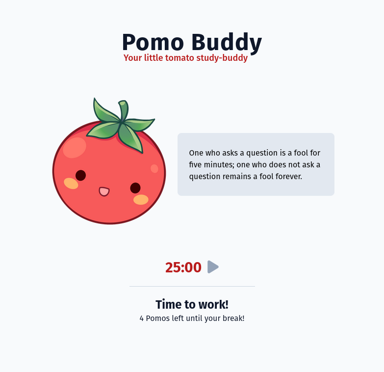

# POMO BUDDY

### Your moderately-condescending inspirational little Pomodoro study-buddy

Pomo-Buddy is a wee <a href="https://en.wikipedia.org/wiki/Pomodoro_Technique">Pomodoro</a> timer that keeps you
on-track in your studies or your work! He will be there for you with inspirational, maybe *slightly* condescending
quotes to keep you going and no amount of work or adversity can slap that smile off his face!

### Learning Outcomes

My learning outcomes for this project were to create a Pomodoro timer to continue applying my knowledge of TypeScript
and to learn TailwindCSS.
Tailwind has been an utter blast to work with, and its utility-first approach is incredible in versatility and
modularity. Additionally, I can say that the Tailwind team has chosen wonderful colors, it's hard to get a poor-looking
combination through accident with their well-chosen palettes!

In addition to technologies, I also decided to put a creative flair on this project and drew the Pomodoro buddy myself.

Feel free to try out the running version on 
<a href="https://main--deluxe-pastelito-3fa081.netlify.app/">Netlify</a>
or check out the 
<a href="https://www.figma.com/file/Tvyo2GxrKYva4ksCoGctbS/Untitled?type=design&node-id=1%3A2&mode=design&t=Q7KlXRIoCm4IGHwJ-1">
Figma Design File</a>.

### Tools Used

- Figma
- ProCreate 
- TailwindCSS
- TypeScript
- React / Vite
- <a href="https://type.fit/api/quotes">TypeFit Quotes API</a>

### What's Next?

- Timer customization
- Mobile App!?
- Non-intrusive alarm sounds